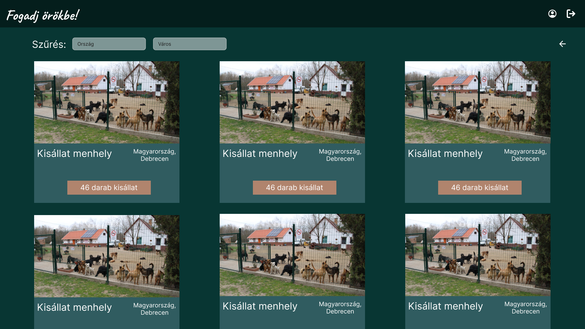
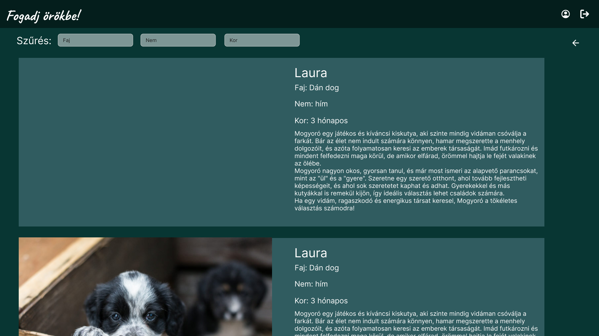
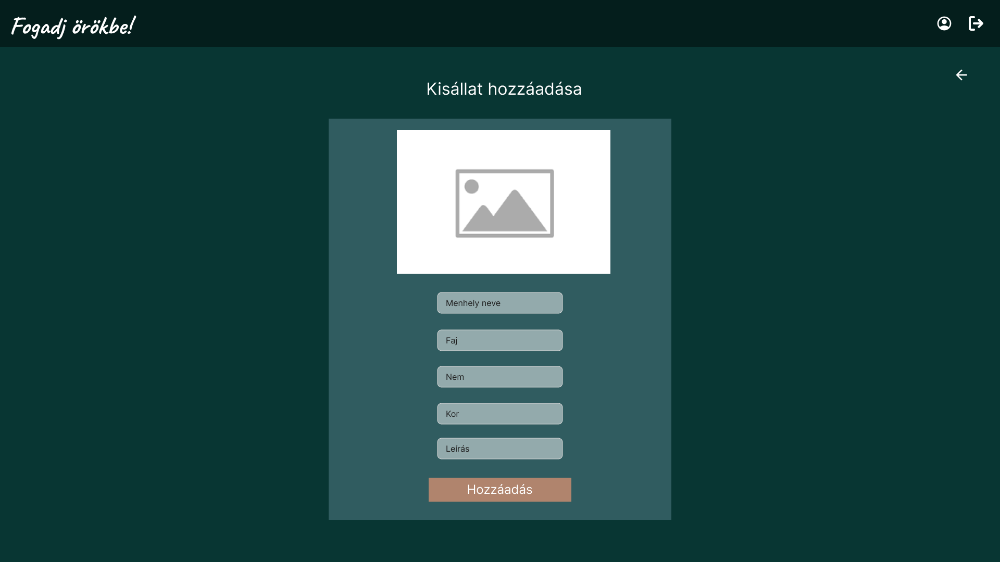
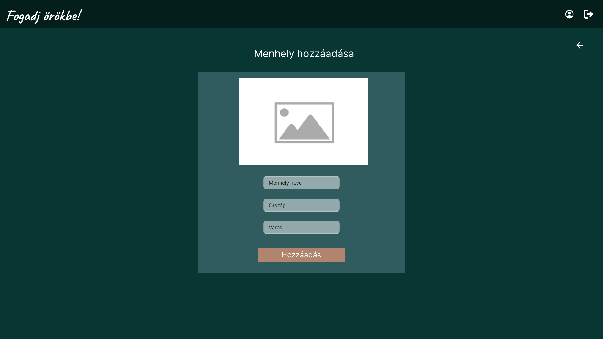

### 4. Jelenlegi üzleti folyamatok modellje
A mai világban egyre nagyobb az igény arra, hogy az emberek gyorsan és egyszerűen találjanak megfelelő menhelyi állatokat örökbefogadásra. Jelenleg sok menhely nem rendelkezik olyan felülettel, ahol könnyen megoszthatnák az állataikat az örökbefogadók számára, így az elérhetőségük korlátozott. A papíralapú nyilvántartás és az elavult rendszerek sok időt vesznek igénybe, és bonyolulttá teszik az állatok adatainak kezelését. Az általunk tervezett weboldal erre kínál megoldást, modern technológiák segítségével könnyen kezelhető, interaktív felületet biztosítva. A rendszer lehetővé teszi az állatok adatainak egyszerű feltöltését, frissítését és nyomon követését, miközben egy központi platformként szolgál az örökbefogadók és menhelyek számára.

### 5. Igényelt üzleti folyamatok modellje
Azért hogy a menhelyek és az örökbefogadók számára egyszerűbbé tegyük a kisállatok örökbefogadásának folyamatát, létrehozunk egy weboldalt, amely lehetőséget biztosít a menhelyek számára, hogy bemutathassák kisállataikat. Az alkalmazásunk egy könnyen kezelhető felületet kínál, amelyet modern webes technológiák segítségével valósítunk meg. A menhelyek egyszerűen feltölthetik, frissíthetik és kezelhetik az állatok adatait, így nem kell minden egyes kisállatot külön-külön bemutatniuk. Ezáltal az örökbefogadók számára sokkal könnyebbé válik a választás, hiszen egy helyen találhatják meg az összes elérhető kisállatot. A rendszer nemcsak a menhelyek, hanem a potenciális örökbefogadók számára is hasznos, mivel gyorsan és könnyen hozzáférhetnek az információkhoz, és azonnal értesülnek a kisállatok állapotáról és elérhetőségéről. Ezzel a platformmal szeretnénk elősegíteni az állatok örökbefogadását, és egy szorosabb kapcsolatot kialakítani a menhelyek és az örökbefogadók között.

### 6. Használati esetek
*Felhasználói Szerepkörök a Fogadj örökbe Weboldalon*

**REGISZTRÁLT FELHASZNÁLÓ:**

- Kereshet állatokat és menhelyeket, valamint szűrhet az elérhetőség, fajta és kor alapján.
- Hozzászólhat az állatok profiljához, és értékelheti a menhelyek szolgáltatásait.
- Megoszthatja saját örökbefogadási élményeit, tapasztalatait más felhasználókkal.

**MENHELYTULAJDONOS:**

- Képes egy új állatmenhelyet létrehozni, ahol bemutathatja az örökbefogadható állatokat.
- Feltöltheti az állatok adatait, beleértve a képeket, leírásokat és egyéb fontos információkat.
- Frissítheti az állatok állapotát, például amikor egy állat örökbefogadásra kerül, vagy új információkat adhat meg az állatokkal kapcsolatban.

**LÁTOGATÓ (regisztráció nélkül):**

- Böngészhet az állatok és menhelyek között.

**ADMINISZTRÁTOR:**

- Teljes hozzáférése van a rendszerhez.

**Használati esetek példái:**

**Állat Keresése:**

- A felhasználó bejelentkezik, keres egy adott fajtát vagy menhelyet, és megtekinti az elérhető állatok listáját.

**Menhely Létrehozása:**

- A menhelytulajdonos bejelentkezik, létrehoz egy új állatmenhelyet, majd feltölti az örökbefogadható állatokat a megfelelő információkkal.

**Adminisztrátor Beavatkozása:**

- Az adminisztrátor egy problémás tartalmat észlel az állatok profilja között, amely nem felel meg az irányelveknek, és eltávolítja azt a platformról.

### 7. Használati esetek:
**Felhasználói szerepkörök:**

1. **REGISZTRÁLT FELHASZNÁLÓ:**
   - Kereshet úticélokat, turisztikai látványosságokat kontinensek, országok és városok szerint.
   - Véleményt írhat és olvashat más felhasználók tapasztalatairól.
   - Hozzászólhat és értékelheti a látványosságokat.
   - Saját utazási élményeit megoszthatja.

2. **LÁTOGATÓ (regisztráció nélkül):**
   - Böngészhet az úticélok és látványosságok között, de nem írhat véleményt vagy értékelést.
   - Megtekintheti más felhasználók véleményeit és értékeléseit.

3. **ADMINISZTRÁTOR:**
   - Teljes hozzáféréssel rendelkezik a rendszerhez, beleértve a felhasználói adatok kezelését és a moderációs funkciókat.
   - Ellenőrzi a felhasználók által megosztott tartalmakat, és moderálja a véleményeket, hogy biztosítsa a platform biztonságát és hitelességét.
   - Új látványosságokat és úticélokat adhat hozzá az adatbázishoz.
   - Képes felhasználói fiókokat létrehozni vagy törölni, valamint globális üzeneteket küldeni a felhasználók számára.

**Használati esetek példái:**

1. **Úticél keresése:**
   - A felhasználó bejelentkezik, keres egy adott országot vagy várost, és megtekinti a látványosságok listáját.
   - Kiválaszt egy helyszínt, és elolvassa mások értékeléseit és véleményeit.

2. **Vélemény írása:**
   - Egy felhasználó meglátogat egy látványosságot, majd értékelést és tapasztalatot ír az oldalra.
   - Más felhasználók hozzászólhatnak a véleményhez, és értékelhetik azt (pl. "hasznos" vagy "nem hasznos").

3. **Adminisztrátor beavatkozása:**
   - Az adminisztrátor egy problémás tartalmat észlel a vélemények között, amely nem felel meg az irányelveknek, és eltávolítja azt a platformról.
   - Új úticélokat ad hozzá, amelyekről a felhasználók véleményt alkothatnak.

---
### 8. Megfeleltetés (Használati esetek és követelmények):

| Követelmény                                  | Használati eset                                                                                       | Szerepkörök                              |
|----------------------------------------------|-------------------------------------------------------------------------------------------------------|------------------------------------------|
| Keresés úticélok, látványosságok között      | 1. **Úticél keresése:** Felhasználó kontinensek, országok és városok szerint kereshet turisztikai helyszíneket. | Regisztrált felhasználó, Látogató        |
| Vélemények írása és olvasása                 | 2. **Vélemény írása:** Felhasználó megosztja élményeit egy látványosságról, és olvassa mások véleményét.       | Regisztrált felhasználó                  |
| Hozzászólás és értékelés                     | 2. **Vélemény írása:** Felhasználó hozzászól egy meglévő véleményhez, értékelheti azt hasznos vagy nem hasznos szempontból. | Regisztrált felhasználó                  |
| Böngészés úticélok és vélemények között      | 1. **Úticél keresése:** Látogató böngészhet az úticélok között, és olvashat véleményeket.                     | Látogató                                 |
| Moderáció és tartalom eltávolítása           | 3. **Adminisztrátor beavatkozása:** Adminisztrátor észleli a nem megfelelő tartalmat, és eltávolítja azt.      | Adminisztrátor                           |
| Új látványosságok, úticélok hozzáadása       | 3. **Adminisztrátor beavatkozása:** Adminisztrátor új látványosságokat és úticélokat ad hozzá.                | Adminisztrátor                           |
| Felhasználói adatok kezelése                 | 3. **Adminisztrátor beavatkozása:** Adminisztrátor kezeli a felhasználói fiókokat, hozzáad vagy töröl fiókokat. | Adminisztrátor                           |
| Globális üzenetek küldése                    | 3. **Adminisztrátor beavatkozása:** Adminisztrátor globális üzenetet küld a felhasználók számára.             | Adminisztrátor                           |
| Utazási élmények megosztása                  | 2. **Vélemény írása:** Felhasználó megosztja személyes utazási élményeit a platformon.                        | Regisztrált felhasználó                  |

### Képernyő tervek:
#### Desktop nézetek:
##### Érkezési oldal

##### Bejelentkezés oldal

##### Regisztráció oldal

##### Állatmenhelyek oldal

##### Örökbefogadásra váró állatok oldal

##### Profil oldal, felhasználói nézetben

##### Kisállat feltöltése oldal

##### Kisállat módosítása oldal

##### Állatmenhely hozzáadása oldal

##### Állatmenhely módosítása oldal

### 9. Forgatókönyv:

### 1. Érkezési Oldal
- **Célja**: A látogatók üdvözlése és a weboldal bemutatása.
- **Fő elemek**:
    - **Navigációs sáv(Hamburger menü)**
    - **Hős szekció**:
        - Üdvözlése a felhasználónak.
        - A felhasznéló posztjai edit módban.
        - **Call to Action (CTA)** gombok: "Új poszt".

---

### 2. Profil oldal
- **Célja**: A felhasználó látja és szerkesztheti a saját posztjait, illetve új posztokat is hozzáadhat.
- **Fő elemek**:
    - **Navigációs sáv(Hamburger menü)**: Logó, Hamburger menü, Menüpontok (Poszt (Poszt feltöltése, Poszt módosítása, Poszt törlése), Fiók (Profil, Bejelntkezés, Fiók műveletek, Kijelentkezés)), cégnév, about leíró oldal, Term and policy.
    - **Hős szekció**:
        - Nagy, figyelemfelkeltő szöveg.
        - Posztok
        - **Call to Action (CTA)** gombok: "Bejelentkezés", "Regisztrálás".

---

### 3. Bejelentkezés/Regisztráció
- **Célja**: A látogató (guest) bejelentkezthet vagy regisztrálhat.
- **Fő elemek**:
    - **Navigációs sáv(Hamburger menü)**: Logó, Hamburger menü, Menüpontok (Poszt (Poszt feltöltése, Poszt módosítása, Poszt törlése), Fiók (Profil, Bejelntkezés, Fiók műveletek, Kijelentkezés)), cégnév, about leíró oldal, Term and policy.
    - **Hős szekció**:
        - Bejelentkezési űrlap/Regisztrációs űrlap
   - **Lábléc**: Adathasználati irányelvek és a cég neve

---

### 4. Fiók műveletek
- **Célja**: A felhasználó itt tud módosítasokat végrhajtani a fiókjával kapcsolatban.
- **Fő elemek**:
    - **Navigációs sáv(Hamburger menü)**: Logó, Hamburger menü, Menüpontok (Poszt (Poszt feltöltése, Poszt módosítása, Poszt törlése), Fiók (Profil, Bejelntkezés, Fiók műveletek, Kijelentkezés)), cégnév, about leíró oldal, Term and policy.
    - **Hős szekció**:
        - Egy felhasználónév csere űrlap.
        - Egy jelszó csere űrlap.
        - Egy fiók törlése gomb.

---

### 5. Megnyitott Poszt
- **Célja**: A felhasználó/látogató (guest) itt tudja a képet nagyobb formátumban megnézni, illetve a kommenteket. A felhasználó új kommentet is tud hozzáadni. Illetve mind a felhasználó, mind a látogató (guest) tudja értékelni a posztot.
- **Fő elemek**:
    - **Navigációs sáv(Hamburger menü)**: Logó, Hamburger menü, Menüpontok (Poszt (Poszt feltöltése, Poszt módosítása, Poszt törlése), Fiók (Profil, Bejelntkezés, Fiók műveletek, Kijelentkezés)), cégnév, about leíró oldal, Term and policy.
    - **Hős szekció**:
        - A kép.
        - A poszt helye a világban.
        - Értékelések.
        - Kommentek és/vagy komment írása.

---

### 6. Hírfolyam
- **Célja**: A felhasználó/látogató (guest) láthatja mások posztjai, illetve szűrhet közöttük.
- **Fő elemek**:
    - **Navigációs sáv(Hamburger menü)**: Logó, Hamburger menü, Menüpontok (Poszt (Poszt feltöltése, Poszt módosítása, Poszt törlése), Fiók (Profil, Bejelntkezés, Fiók műveletek, Kijelentkezés)), cégnév, about leíró oldal, Term and policy.
    - **Hős szekció**:
        - Köszöntő rész
        - Szűrési sáv.
        - Posztok

---

### 7. Poszt feltöltése
- **Célja**: A felhasználó/admin itt tud új posztot hozzáadni.
- **Fő elemek**:
    - **Navigációs sáv(Hamburger menü)**: Logó, Hamburger menü, Menüpontok (Poszt (Poszt feltöltése, Poszt módosítása, Poszt törlése), Fiók (Profil, Bejelntkezés, Fiók műveletek, Kijelentkezés)), cégnév, about leíró oldal, Term and policy.
    - **Hős szekció**:
        - Kép beillesztésének helye
        - Adatok a posztról
        - Feltöltés gomb.
   - **Megközelíthetőség**: A felhasználó/admin vagy a menüből érheti el, vagy a profiljából az "Új poszt" gombra kattintva.

---

### 8. Poszt módosítása
- **Célja**: A felhasználó/admin itt tud meglévő posztot módosítani.
- **Fő elemek**:
    - **Navigációs sáv(Hamburger menü)**: Logó, Hamburger menü, Menüpontok (Poszt (Poszt feltöltése, Poszt módosítása, Poszt törlése), Fiók (Profil, Bejelntkezés, Fiók műveletek, Kijelentkezés)), cégnév, about leíró oldal, Term and policy.
    - **Hős szekció**:
        - Kép módosításának helye
        - Adatok a posztról és annak a megváltozatatása
        - Módoítás gomb.
   - **Megközelíthetőség**: A felhasználó/admin csak a profiljából a poszt alatti "Módosítás" gombra kattintva érheti el.

---
