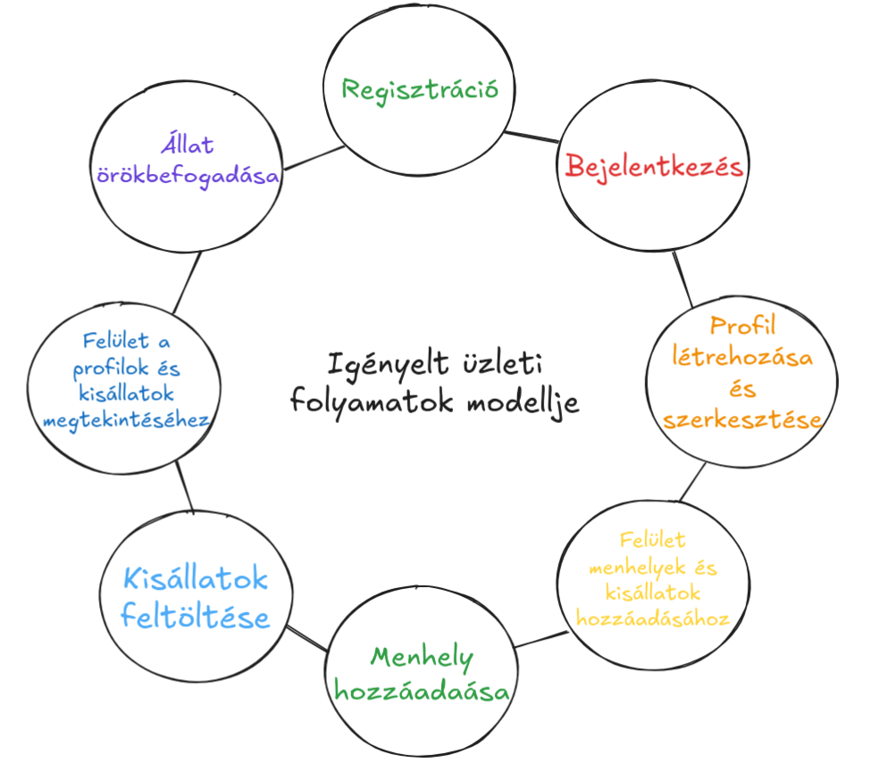

# Követelmény specifikáció

## 1. Áttekintés
A cél egy olyan weboldal létrehozása, amely lehetőséget biztosít menhelyek számára, hogy kisállataikat megoszthassák és bemutathassák az örökbefogadók számára. Az alkalmazásunk könnyen kezelhető felületet biztosít majd, amelyet modern webes technológiák segítségével valósítunk meg. A rendszer lehetőséget nyújt az állatok adatainak egyszerű feltöltésére, frissítésére és kezelésére, miközben egy központi platformként szolgál minden felhasználó számára.

## 2. Jelenlegi helyzet
Jelenleg a menhelyek gyakran egyedi weboldalakat vagy közösségi média platformokat használnak arra, hogy kisállataikat bemutassák, ami időigényes és nem mindig hatékony. Sok menhely nem rendelkezik megfelelő eszközökkel és erőforrásokkal ahhoz, hogy professzionális megoldásokat használjon. Ez megnehezíti a kisállatok örökbe adását, mivel az információk nem egységesek, nehezen találhatók meg.

## 3. Vágyálom rendszer
A vágyálom rendszer egy olyan weboldal lenne, amely centralizált platformként működik, és lehetőséget biztosít minden menhely számára, hogy egy közös felületen keresztül osszák meg a kisállatokat. A rendszer egyszerűsítené az állatok adatainak feltöltését, karbantartását és megjelenítését, miközben javítaná a kisállatok láthatóságát. A cél az, hogy a menhelyek hatékonyabban találjanak új gazdákat a náluk lévő állatok számára, és csökkentsék a weboldalak kezelésével járó terheket.

## 4. Funkcionális követelmények

1. **Felhasználói funkciók**:
   - **Regisztráció és bejelentkezés**: A leendő örökbefogadók és menhelyek számára lehetőség nyílik felhasználói fiók létrehozására. Bejelentkezés után hozzáférhetnek az állatok adatlapjaihoz, és menhelyek esetében az állatok feltöltéséhez.
   - **Állatok böngészése**: A látogatók kereshetnek és szűrhetnek az örökbe fogadható állatok között különböző paraméterek alapján (pl. faj, kor, nem, méret).
   - **Állat adatlap megtekintése**: Az állatok részletes adatlapja tartalmazza a nevüket, életkorukat, fajukat, egészségügyi állapotukat, és az örökbefogadási feltételeket.
   - **Kapcsolatfelvétel a menhellyel**: Az érdeklődők közvetlenül üzenhetnek a menhelyeknek, további információt kérve az állatokról vagy az örökbefogadás folyamatáról.

2. **Menhelyi felhasználói funkciók**:
   - **Menhelyi profil létrehozása és kezelése**: A menhelyek számára lehetőséget biztosítunk egy saját fiók létrehozására, ahol részletesen bemutathatják magukat (név, elérhetőségek, cím, nyitvatartás, bemutatkozás).
   - **Több állat kezelése egy fiók alatt**: A menhelyi felhasználók egyszerre több örökbe fogadható állatot tölthetnek fel és kezelhetnek egy profil alatt, így minden állatnak külön adatlapja lesz, de egy közös menhelyi profil alatt jelennek meg.
   - **Állatok adatainak feltöltése és frissítése**: A menhelyi felhasználók létrehozhatnak és szerkeszthetnek állatokat, feltölthetik az állatok képeit, megadhatják a nevüket, fajtájukat, korukat, egészségügyi állapotukat, viselkedési jellemzőiket, valamint az örökbefogadási feltételeket.
   - **Állatok státuszának módosítása**: Lehetőség van az állatok örökbefogadott státuszának kezelésére (pl. "örökbe fogadva" jelölés), illetve ha egy állat már nem elérhető, archiválni vagy törölni az adatlapját.
   - **Értesítési rendszer a menhelyek számára**: Értesítések küldése a menhelyi adminisztrátoroknak, ha egy állat adatlapjára jelentkezés érkezik, vagy érdeklődő üzenetet küldenek az örökbefogadók.

3. **Adminisztrációs funkciók**:
   - **Állatok adatainak feltöltése és frissítése**: A menhelyek felhasználói egyszerűen tölthetnek fel új állatokat a rendszerbe, megadhatják azok adatait és fotóit, valamint frissíthetik ezeket az adatokat szükség szerint.
   - **Állatok kezelése**: Az adminisztrátorok és a menhelyek módosíthatják vagy törölhetik az állatok adatait, ha azok örökbefogadásra kerültek, vagy más okból nem elérhetők.
   
4. **Egyéb funkciók**:
   - **Keresőmotor-optimalizálás (SEO)**: A rendszer úgy van kialakítva, hogy könnyen megtalálható legyen a keresőmotorokban, segítve ezzel az állatok gyorsabb örökbefogadását.

## 5. Rendszerre vonatkozó törvények, szabványok, ajánlások:

1. **Adatvédelmi jogszabályok (GDPR)**
   A rendszerben tárolt adatok jelentős része személyes adatnak minősül, különösen a leendő örökbefogadók és a menhelyi állatok adatai. Ezért biztosítani kell az adatvédelmi rendelet (General Data Protection Regulation, GDPR) előírásainak betartását. Ez magában foglalja:
   - A felhasználók tájékoztatását arról, hogy milyen adatokat tárolnak és dolgoznak fel.
   - Az adatokhoz való hozzáférés, javítás és törlés jogának biztosítása.
   - Megfelelő biztonsági intézkedések bevezetése az adatok védelmére.

2. **Elektronikus kereskedelem és online szolgáltatások törvényei**
   A weboldal működéséhez szükséges, hogy megfeleljen az elektronikus kereskedelemre és online szolgáltatásokra vonatkozó nemzeti és európai uniós szabályozásoknak. Amennyiben az oldal lehetővé teszi adományok fogadását vagy fizetési tranzakciókat, ezekre speciális előírások vonatkoznak.

3. **WCAG (Web Content Accessibility Guidelines) ajánlások**
   Az akadálymentesség biztosítása érdekében a weboldal kialakításának meg kell felelnie a Web Content Accessibility Guidelines (WCAG) szabványnak. Ez lehetővé teszi, hogy a fogyatékkal élő felhasználók is hozzáférjenek az oldal tartalmához, különös tekintettel a vizuális vagy hallási nehézségekkel küzdő felhasználókra.

4. **Biztonsági szabványok**
   A felhasználói adatok védelme érdekében a weboldal kialakításakor figyelembe kell venni a modern biztonsági szabványokat, mint például a HTTPS titkosítást, kétfaktoros hitelesítést, valamint az SQL injection és cross-site scripting (XSS) elleni védekezést.

5. **ISO 27001 szabvány**
   Ha a projekt kiterjedt adatkezelési folyamataival és biztonsági kérdéseivel foglalkozik, érdemes az ISO 27001 szabvány alkalmazását megfontolni, amely egy nemzetközi szabvány az információbiztonsági irányítási rendszerekhez (ISMS).

## 6. Jelenlegi üzleti folyamatok modellje

A mai világban a menhelyek gyakran hagyományos, elavult módszereket használnak a gondozott kisállatok bemutatására és örökbefogadásra való felkínálására. A legtöbb menhely nem rendelkezik integrált online rendszerrel, így a potenciális örökbefogadók nehezen találják meg az adott menhely által kínált kisállatokat, és a menhelyek is korlátozottan tudják frissíteni az elérhető állatok adatait. Jelenleg a legtöbb menhely csupán papír alapú nyilvántartásokat vezet, vagy különálló, nem központi adatbázisokat használnak, ami növeli az adminisztrációs terheket és az adatok frissítésének bonyolultságát. Ezen felül, sok menhelynek csupán közösségi média felületeken van lehetősége állataikat bemutatni, ami korlátozza az elérhető közönséget, és nem biztosít egy átlátható, jól strukturált felületet az örökbefogadók számára. 

Az alkalmazásunk célja, hogy ezt a folyamatot teljesen új alapokra helyezze. Az általunk fejlesztett platform egy könnyen kezelhető, központi rendszert biztosít, amely lehetőséget nyújt a menhelyek számára, hogy digitálisan feltölthessék, frissíthessék és kezelhessék a kisállatok adatait, fotóit, valamint a lehetséges örökbefogadók egy modern, felhasználóbarát felületen keresztül böngészhessék az elérhető állatokat. Ez a rendszer nem csak csökkenti az adminisztrációs terheket, hanem megkönnyíti az örökbefogadók számára is a megfelelő kisállat kiválasztását és örökbefogadását, mindezt a mai technológiai lehetőségek kihasználásával.

## 7. Igényelt üzleti folyamatok

A megrendelő a fő oldalon akar bejelentkezni (felhasználónév, jelszó), valamint a regisztrációt megkezdeni, mely egy új oldalon folytatódna (felh., jelszó, e-mail).
Bejelentkezést követően lehetőséget, hozzáférést kell adni szerepkörtől függően az alkalmazás funkcióihoz.
A menhelyek profiljait létrehozni és szerketszteni a gondozók tudják.
Menhelyeket és örökbefogadásra váró kisállatokat is csak gondozók tudják hozzáadni már meglévő menhelyekhez.
Ezután a felhasználók ezeket a menhely profilokat és kisállatokat tudják böngészni, lehetőségük van örökbefogadni egy vagy több kisállatot.

## 8. Követelménylista

| Modul ID      | Név                        | Verzió | Kifejtés                                                                                                                                                                                                                                   |
|---------------|-----------------------------|--------|--------------------------------------------------------------------------------------------------------------------------------------------------------------------------------------------------------------------------------------------|
| Jogosultság M1 | Menhely regisztráció        | 1.0    | A menhelyek a nevük, e-mail címük és jelszavuk megadásával regisztrálhatnak. Amennyiben az adatok hiányosak vagy hibásak, a rendszer figyelmezteti a felhasználót.                                   |
| Jogosultság M2 | Belépési felület            | 1.0    | A menhelyek, adminok és felhasználók beléphetnek az e-mail címük és jelszavuk megadásával. Hibás adatok esetén a felhasználó hibaüzenetet kap.                                                                     |
| Jogosultság M3 | Jogosultsági szintek        | 1.0    | - **Admin:** új menhelyek jóváhagyása, felhasználók kezelése    - **Menhely:** profil létrehozása, állatok feltöltése, adatok módosítása    - **Vendég:** regisztráció és belépés, állatok keresése  |
| Adatkezelés A1 | Menhely profil              | 1.0    | A menhelyek létrehozhatják profiljaikat, ahol bemutathatják magukat, feltölthetik logójukat, elérhetőségeiket és rövid leírást adhatnak magukról.                                                    |
| Adatkezelés A2 | Állat feltöltése            | 1.0    | A menhelyek feltölthetik a gondozásukban lévő állatokat a nevük, fajtájuk, koruk, egészségi állapotuk, oltottságuk és fényképek megadásával.                                                         |
| Adatkezelés A3 | Állat adatainak módosítása  | 1.0    | A menhelyek módosíthatják a már feltöltött állatok adatait, például a gazdira találás státuszát, egészségi állapot változását vagy új képek feltöltését.                                             |
| Keresés K1     | Kereső funkció              | 1.0    | A vendégek és regisztrált felhasználók böngészhetnek az adatbázisban szűrők használatával (pl. fajta, menhely neve, település).                                                                 |                      
| Felhasználó K5 | Felhasználói módosítások    | 1.0    | A menhelyek módosíthatják saját profiladataikat, például a leírást, logót, illetve elérhetőségi adatokat.                                                                                           |
| Biztonság B1   | Adatbiztonság és mentés     | 1.0    | A rendszer titkosítva tárolja a felhasználói jelszavat.                                                                                     |

## 9. Riportok

## 10. Fogalomtár

### PHP
Egy szerveroldali szkriptnyelv, amelyet webes alkalmazások fejlesztéséhez használnak. A PHP feldolgozza a felhasználói kéréseket, dinamikus tartalmat hoz létre, és adatbázis-műveleteket hajt végre.

### JavaScript
Kliensoldali programozási nyelv, amely interaktivitást és dinamikus viselkedést biztosít a weboldalon. Lehetővé teszi az elemek valós idejű frissítését, mint például űrlapok kezelése, animációk vagy felhasználói élmény javítása.

### Session
A session (munkamenet) egy olyan állapotmegőrzési mechanizmus, amely lehetővé teszi, hogy a szerver adatokat tároljon egy adott felhasználóról a böngészési folyamat során. Az állat örökbefogadásra szolgáló oldal például session-t használhat, hogy megjegyezze a felhasználó által kiválasztott állatokat.

### CSS (Cascading Style Sheets)
A CSS segítségével a weboldal megjelenését és stílusát határozzuk meg, például a színeket, betűtípusokat, elrendezést. A reszponzív felületek kialakításához is szükséges, hogy az oldal esztétikailag megfelelően jelenjen meg különböző eszközökön (mobil, tablet, PC).

### Reszponzív felület
Olyan weboldal, amely alkalmazkodik a különböző képernyőméretekhez (mobil, tablet, PC), biztosítva, hogy a felület minden eszközön könnyen használható és jól megjelenő legyen.

### Adatbázis
Az adatbázis a webalkalmazásban az állatok adatait, a felhasználói profilokat és az örökbefogadási kérelmeket tárolja. PHP segítségével kapcsolódik az adatbázishoz a dinamikus tartalom kiszolgálására.

### Űrlap
Az űrlapok azok az elemek az oldalon, amelyeken keresztül a felhasználók adatokat küldhetnek be, például örökbefogadási kérelmet, regisztrációt vagy kapcsolatfelvételt. JavaScript és PHP segítségével az űrlapok validálása és feldolgozása történik.

### API
Egy alkalmazás programozási felülete, amely lehetővé teszi a különböző szoftverek közötti kommunikációt. Weboldalunk egy külső API-t is használhat, például állatmenhelyek adatainak lekéréséhez.

