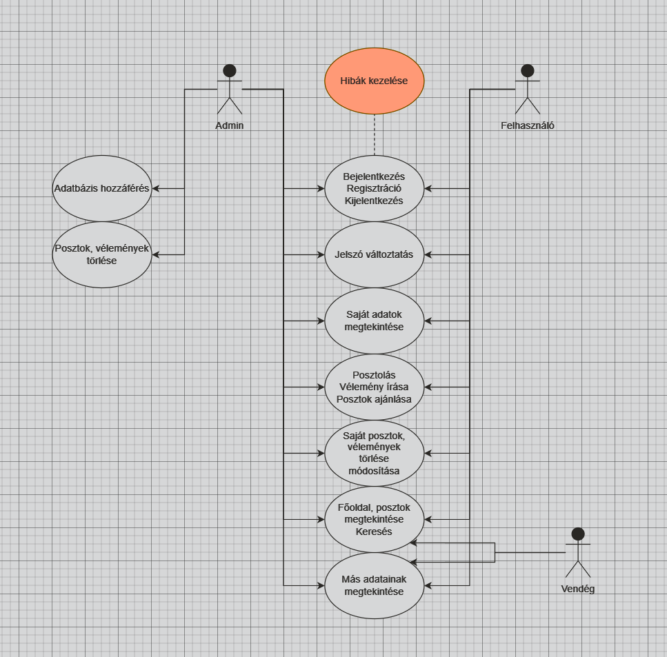

# Rendszerterv

## 1. A rendszer célja

Ez a webhely azért létezik, hogy összekösse az állatmenhelyeket és az azokban élő áldozatokat azokkal az emberekkel, akik szeretnének örökbe fogadni őket. Ez a platform segíthet növelni az állatok elhelyezkedési arányát, míg ugyanakkor támogatja a menhelyeket és az ott dolgozókat is.

## 2. Projektterv

- **Scrum master:** Labancz Tamás
  Feladata a fejlesztési folyamatok koordinálása, a csapat támogatása a munkafolyamatok gördülékeny működésében.

- **Reviewer:** Székely Zsolt
  Felelős az alkalmazás céljainak meghatározásáért és az ügyféligények képviseletéért. Prioritásokat állít fel a fejlesztési backlog alapján.

- **Board Manager:** Vértesi Szabolcs Dominik
  Felelős az alkalmazás céljainak meghatározásáért és az ügyféligények képviseletéért. Prioritásokat állít fel a fejlesztési backlog alapján.

- **Developer:** Dobrosi Gergő
  Felelős az alkalmazás céljainak meghatározásáért és az ügyféligények képviseletéért. Prioritásokat állít fel a fejlesztési backlog alapján.

- **Projektmunkások és felelősségek:**

  - **Frontend fejlesztők:**
    Feladatuk az alkalmazás webes felületének kialakítása, a felhasználói élmény megtervezése és megvalósítása.

  - **Backend fejlesztők:**
    Feladatuk az adatbázis felépítése, az adatszerkezetek megtervezése és a Web Service megvalósítása, amely az alkalmazás adatait biztosítja.

  - **UI/UX tervezők:**
    Felelősek az egyszerű, intuitív felhasználói felület megtervezéséért, amely segíti a felhasználókat az alkalmazás használatában.

  - **Tesztelők:**
    Feladatuk az alkalmazás funkcióinak és teljesítményének ellenőrzése, hibakeresés és visszajelzések küldése a fejlesztők számára.

**Ütemterv:**

| Funkció / Story              | Feladat / Task                     | Prioritás | Becslés (óra) | Aktuális becslés | Eltelt idő (óra) | Hátralévő idő (óra) |
|------------------------------|------------------------------------|-----------|---------------|------------------|------------------|---------------------|
| Követelmény specifikáció      | A rendszer igényeinek felmérése    | 0         | 16            | 16               | 16               | 0                   |
| Funkcionális specifikáció     | Az alapvető funkciók meghatározása | 0         | 12            | 12               | 8                | 4                   |
| Rendszerterv                  | Műszaki dokumentáció elkészítése   | 0         | 20            | 20               | 12               | 8                   |
| Adattárolás                   | Adatmodell megtervezése            | 0         | 8             | 8                | 4                | 4                   |
| Adatbázis megvalósítása       | Szerveren futó adatbázis létrehozása| 1         | 10            | 10               | 5                | 5                   |
| Frontend fejlesztés           | Felhasználói felület kialakítása   | 2         | 20            | 20               | 10               | 10                  |
| Véleményezés funkció          | Vélemények megosztásának megoldása | 2         | 10            | 10               | 5                | 5                   |
---
\
**Mérföldkövek:**

1. **Követelmény specifikáció bemutatása** – Sikeresen befejeződött, minden kulcsfontosságú igény meghatározásra került.
2. **Adatmodell bemutatása** – Az adatstruktúrák elkészültek, és jóváhagyásra kerültek a backend fejlesztés megkezdése előtt.
3. **Első felhasználói teszt** – A felhasználói felület alapverziója készen áll a tesztelésre.
4. **Backend integráció tesztelése** – A Web Service és az adatbázis összekapcsolása megtörtént.

Az ütemterv folyamatosan frissül a fejlesztés előrehaladtával, és a Scrum módszertan alapján történik a feladatok kiértékelése és újraütemezése.

## 3. Üzleti folyamatok modellje

## 5. Funkcionális terv

### Rendszerszereplők:
- Adminisztrátor
- Menhelytulajdonos
- Regisztrált Felhasználó
- Látogató

### Rendszerhasználati esetek és lefutásaik:

**ADMINISZTRÁTOR:**
- Teljes hozzáféréssel rendelkezik a rendszerhez, beleértve a felhasználói adatokat.
- Ellenőrzi a felhasználók által megosztott tartalmakat és moderálja az állatok profilját.
- A rendszer biztonsági és adatvédelmi beállításait kezelheti.

**MENHELYTULAJDONOS:**
- Képes egy új állatmenhelyet létrehozni.
- Feltöltheti az örökbefogadható állatok adatait (név, fajta, kor, leírás, kép).
- Frissítheti az állatok állapotát (pl. örökbefogadva, elérhető).
- Megoszthatja a menhelyhez kapcsolódó információkat a felhasználókkal.

**REGISZTRÁLT FELHASZNÁLÓ:**
- Böngészhet az állatok és menhelyek között.
- Örökbefogadhat állatokat.

**LÁTOGATÓ (regisztráció nélkül):**
- Böngészhet az állatok és menhelyek között.

### Menü-hierarchiák:
- **BEJELENTKEZÉS**
  - Bejelentkezés
  - Regisztráció
  - Segítség (Help)

- **FŐMENÜ**
  - Állatok keresése
  - Menhelyek keresése
  - Személyes adatok
  - Kijelentkezés

## 6. Fizikai környezet 
### Platform és Fejlesztési Környezet

- Az alkalmazás webes platformra készül, amely elérhető asztali és mobil böngészőkön is, így a felhasználók könnyen hozzáférhetnek az örökbefogadási információkhoz bármilyen eszközről (például számítógép, okostelefon, táblagép).

- Nincsenek megvásárolt komponenseink, az alkalmazás teljes mértékben saját fejlesztés.

- **Fejlesztői eszközök:**
  - Visual Studio Code
  - Git
  - Bootstrap

Ezek az eszközök lehetővé teszik a hatékony fejlesztést és a rugalmas munkafolyamatokat, biztosítva, hogy az alkalmazás felhasználóbarát és funkcionális legyen.

## 7. Absztrakt domain modell
### Absztrakt Domain Modell

Az absztrakt domain modell a rendszer fő entitásait és azok közötti kapcsolatait ábrázolja. Az alábbiakban bemutatjuk az örökbefogadási weboldal főbb entitásait és azok tulajdonságait:

1. **Felhasználó**
   - **Azonosító** (userId)
   - **Név** (name)
   - **E-mail cím** (email)
   - **Jelszó** (password)
   - **Szerepkör** (role) – lehetséges értékek: REGISZTRÁLT FELHASZNÁLÓ, MENHELYTULAJDONOS, ADMINISZTRÁTOR
   - **Örökbefogadási élmények** (adoptionExperiences) – a felhasználó által megosztott élmények listája

2. **Menhely**
   - **Azonosító** (shelterId)
   - **Név** (name)
   - **Cím** (address)
   - **Telefonszám** (phoneNumber)
   - **Leírás** (description)
   - **Kép** (image) – a menhelyhez tartozó kép
   - **Örökbefogadható állatok** (adoptableAnimals) – a menhelyhez tartozó állatok listája

3. **Állat**
   - **Azonosító** (animalId)
   - **Név** (name)
   - **Fajta** (breed)
   - **Kor** (age)
   - **Nem** (gender)
   - **Állapot** (status) – például "elérhető", "örökbefogadva"
   - **Leírás** (description)
   - **Kép** (image) – az állathoz tartozó kép
   - **Menhely** (shelter) – az állatot gondozó menhely

### Kapcsolatok

- **Felhasználó és Menhely**: A felhasználó létrehozhat egy menhelyet (Menhelytulajdonos szerepkör), és nyomon követheti az örökbefogadható állatokat.
- **Menhely és Állat**: Egy menhely több állatot is gondozhat, míg egy állat egy adott menhelyhez tartozik.

Ez az absztrakt domain modell segít a rendszer tervezésében, megkönnyítve a funkcionális követelmények meghatározását és a rendszer architektúrájának kidolgozását.

## 8. Architekturális terv
### Architekturális Terv
**Backend:**
- Backend (Saját MVC keretrendszer): A backend az egyedi MVC (Model-View-Controller)        architektúra alapján épül fel, amely tiszta elkülönítést biztosít a logika, az adatkezelés és a megjelenítés között.

**Adatbázis (dbForge és MySQL):**
- Az adatbázis-kezelést MySQL végzi, amely a blogbejegyzéseket, felhasználói adatokat, kommenteket és egyéb kapcsolódó adatokat tárol. dbForge-ot használunk az adatbázis tervezésére, karbantartására és a lekérdezések optimalizálására. A dbForge biztosítja az adatbázis struktúrák, relációk és indexelések vizuális kezelését, ami megkönnyíti az adatbázis fejlődésének nyomon követését és hatékony működését.

**Biztonság:**
- A felhasználói jelszavak bcrypt alapú titkosítással vannak tárolva az adatbázisban.

Ez az architekturális terv biztosítja a rendszer hatékony, biztonságos és felhasználóbarát működését, lehetővé téve az örökbefogadási információk egyszerű és gyors kezelését.
## 10. Implementációs terv:
A Webes felület főként **HTML**, **CSS**, **PHP**, **Javascript** nyelven fog készülni.
Ezeket a technológiákat amennyire csak lehet külön fájlokba írva készítjük, és
úgy fogjuk egymáshoz csatolni a jobb átláthatóság, könnyebb változtathatóság,
és könnyebb bővítés érdekében. Képes lesz felhasználni a Backend részen futó
REST szolgáltatás metódusait, ezáltal tud felvinni és lekérdezni adatokat az
adatbázisból. Az eltelt időt a kliens fogja számolni a feladatoknál, hogy ne
legyenek eltérések. Legfőképpen PHP-t fogunk használni.

## 11. Tesztterv:
### Unit teszt:
Minden lehetséges és fontosabb kisebb részt tesztelni, akár egy form mezőjétől a gombok működéséig, illetve a szélsőséges esetek letesztelése, akár a null, illetve nagy számok tesztjei.
### Alfa teszt:
Itt leteszteljük, hogy mindne böngészőben, illetve milyen verziókban működik a webapp.
### Beta teszt:
A termék reszponzivitásának tesztelése különboző eszközöken és technológiákon.
### Tesztelendő funkciók:
- **Bejelentkezés**
- **Regisztráció**
- **Poszt feltöltése**
- **Poszt módosítása**
- **Felhasználónév módosítása**
- **Jelszó módosítása**
- **Profil törlése**
- **Poszt értékelése**
- **Poszt kommentelése**
- **Posztok szűrése**
- **Keresési tesztek**

## 12. Telepítési terv:
A szoftver webes felületéhez csak egy ajánlott böngésző telepítése
szükséges (Google Chrome, Firefox, Opera, Safari), külön szoftver
nem kell hozzá. A webszerverre közvetlenül az internetről
kapcsolódnak rá a kliensek.
## 13. Karbantartási terv:

1. **Biztonsági frissítések**:  
   - Rendszeres ellenőrzés a PHP és MySQL verziófrissítésekhez.  
   - Automatikus biztonsági mentések beállítása (napi/heti).

2. **Adatbázis optimalizálás**:  
   - Túlméretes táblák optimalizálása (pl. indexek létrehozása).  
   - Redundáns adatbejegyzések eltávolítása.  
   - Adatbázis lekérdezések elemzése és finomítása.

3. **Hibajavítások**:  
   - Felhasználói hibajelentések azonnali kezelése.  
   - PHP error log rendszeres áttekintése.

4. **Funkciók tesztelése**:  
   - Weboldal funkcióinak havi manuális tesztelése.  
   - Automatikus tesztelési scriptek futtatása kritikus elemekre.

5. **Biztonsági intézkedések**:  
   - SSL tanúsítványok frissítése.  
   - Jelszóval védett adminisztrációs felületek rendszeres felülvizsgálata.

6. **Tárhely karbantartása**:  
   - Szerver erőforrás-használat figyelése (pl. CPU, RAM).  
   - Lejárt log fájlok és ideiglenes fájlok törlése.
